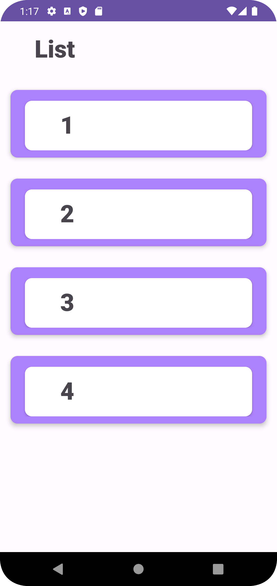
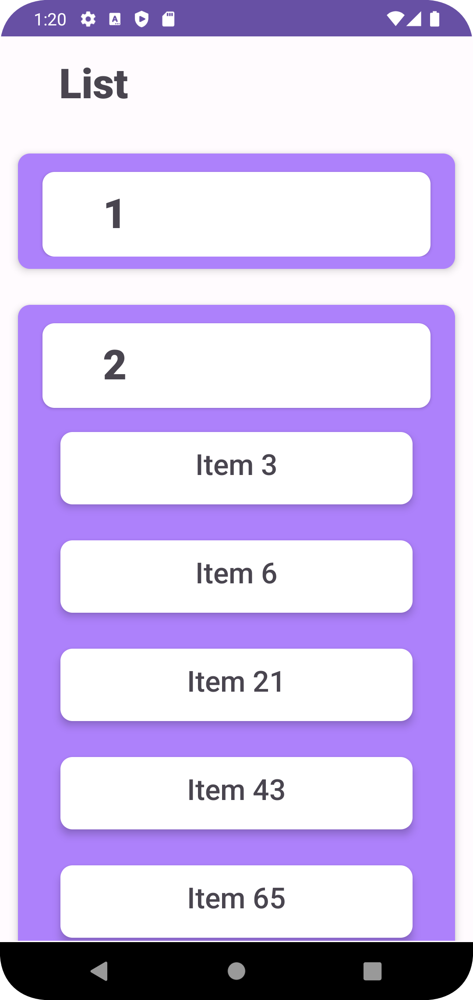
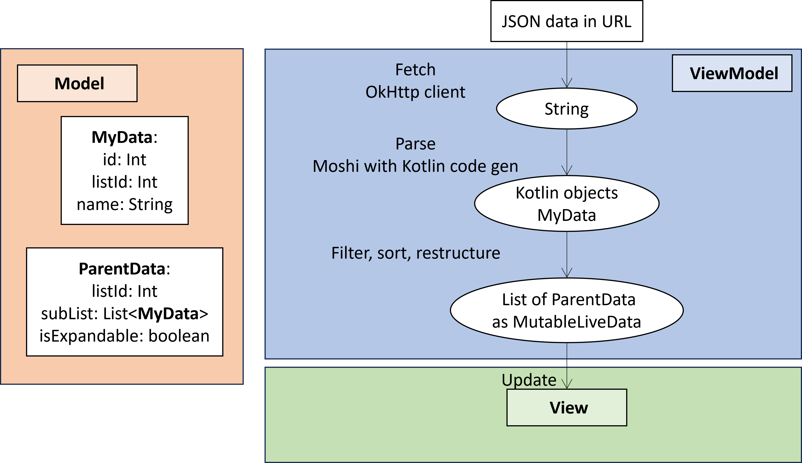

# Fetch Rewards Coding Exercise - Software Engineering - Android

### Requirements:

Please write a native Android app in Kotlin or Java that retrieves the data from https://fetch-hiring.s3.amazonaws.com/hiring.json.

Display this list of items to the user based on the following requirements:

- Display all the items grouped by "listId"
- Sort the results first by "listId" then by "name" when displaying.
- Filter out any items where "name" is blank or null.

The final result should be displayed to the user in an easy-to-read list.

Please make the project buildable on the latest (non-pre release) tools and supporting the current release mobile OS.

### Understanding the scope and the requirements

1. It is a native Android app built in Kotlin or Java using stable, latest versions of tools.
2. The data source is specified and valid.
3. The function of the app is to display the list of items from the data source.
   1. Items with blank or null "name" are filtered out.
   2. Items are grouped by "listId"
   3. Items are sorted by "listId" and then by "name"
4. The list should be easy-to-read.
Notes: Each item has three attributes: "id", "listId", and "name". The name is a string constructed as "Item xx", where "xx" is an integer equal to the "id". It is not specified in the requirements whether all three attributes should be displayed. 

## Thought Process and Design Choices
The app is a simple one with a single screen and a single endpoint of data retrieval. Despite the simplicity, list display is a very common component in mobile apps. Therefore, my objective is to adhere to established best practices to the best of my knowledge and approach the development as if it were a real-world project.

### App Architecture
Even though it is a simple app, I followed the Model-View-ViewModel (MVVM) software architecture so that the app is more modular, scalable, and testable.
- Model: the data class
- ViewModel: handles the business logic, including requesting and parsing data, and feeding ready-to-go data to the View layer
- View: renders the UI; the "Activity" in the context of Android development

### User Interface
Based on the number of items in the list, the main layout of the UI would be a scrollable list implemented with RecyclerView.

In terms of best visualizng the *groups*, it makes the most sense to me to use a nested, expandable list. In other words, a list of groups is displayed on the screen; clicking on each group expands a list of items belonging to that group.

I decided not to show the "id" of each item. One reason is that it is showing redundant information as the "name". In addition, in real life, I would imagine that the "id" is used to identify the items on the backend of the program and "name" is supposed to be displayed to the user. Technically, it is trivial to also display the "id" along with the "name" but I decided to keep it neat for the two reasons above.

The UI looks below. I can see the real-world use of this layout such as showing the categories of brands, furnitures, birds, etc. Depending on what information we would like to display, we can add an image and/or a short descriptions to each item or change the layout to a grid, etc.

  
  

### Data Flow
The data is fetched from the URL using the lightweight OkHttp client and then parsed to Kotlin objects using Moshi with Kotlin code gen. The network process is done asynchronously with the help of Kotlin coroutines. Although, for the size and complexity of data in this project, a synchronous call might not block the main thread much, it is much more scalable to do asynchronous I/O process, thus better practice in general. It also opens the possibility of adding features such as a loading screen.

After processing (filtering, sorting, restructuring), the data is stored as a list of ParentData. This structure of data is needed for the two layers of nested lists. 

To pass the prepared data from the ViewModel to the View, MutableLiveData is used so that the data is aware of the app lifecycle and will preserve and update for our needs. 

Upon user interaction with the screen, in our case a click event, the View will call a function in the ViewModel so that it is always the ViewModel that handles the business logic. After the ViewModel toggles the "isExpandable" attribute of the corresponding ParentData, it will update the MutableLiveData. The View will observe the update in data and update the UI accordingly.

  

With the scope of this project, the data are fetched once on the creation of the activity and saved in memory. If the data is very large and the data handling is more complex, then it could be worth setting up a local database for the data. If the data on the cloud updates frequently, then a refresh feature such as a button or a swipe down refresh could be added for the user to manually update the data.

### Project Configuration
- minimum SDK: API 24 ("Nougat"; Android 7.0; 96% usage)
- target SDK: API 33 ("Tiramisu"; Android 13.0)
- Tested on:
    - Pixel 7 with Tiramisu (API level 33, Android 13.0, x86_64)
    - Pixel 4 with S (API level 31, Android 12.0, x86_64)
    - Pixel 2 with Nougat (API level 24, Android 7.0, x86) - Unexpected behavior noticed: If list 3 is expanded and the user clicks to expand list 2 (positioned above list 3), then the position of list 3 remains the same and list 2 expands upwards showing the bottom of the list.
    - Pixel C with R (API level 30, Android 11.0, x86) - The device is glitchy on my emulator but the app functions normally

## Tests
Unit tests for handling the network responses and the data processing are done. The integration and UI of app are also tested manually on multiple android devices with the help of the emulator. 

## References
- OkHttp: https://www.digitalocean.com/community/tutorials/okhttp-android-example-tutorial
- Moshi GitHub repo: https://github.com/square/moshi
- KSP quick start: https://kotlinlang.org/docs/ksp-quickstart.html
- Migrate from kapt to ksp: https://developer.android.com/build/migrate-to-ksp
- Basic RecyclerView: https://developer.android.com/codelabs/basic-android-kotlin-training-recyclerview-scrollable-list#0
- Expandable Nested RecyclerView: Expandable Nested RecyclerView || Android studio Tutorial 2023
- Test with coroutines: https://kotlinlang.org/api/kotlinx.coroutines/kotlinx-coroutines-test/
- MockWebServer: https://medium.com/@veeresh.charantimath8/mockwebserver-with-kotlin-flows-110d5c2f70e7
